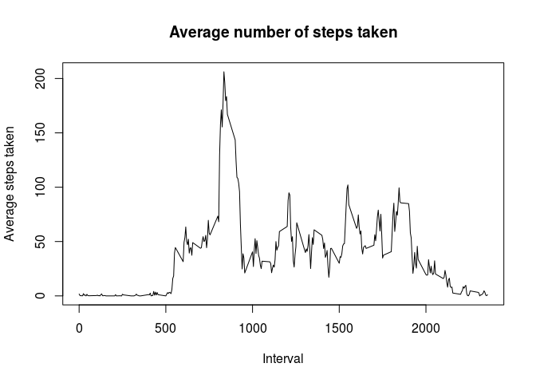

# Reproducible Research: Peer Assessment 1


## Loading and preprocessing the data


Steps:

1. Load the data (i.e. read.csv())


```r
### Unzip and read csv
activity.path <- unzip("activity.zip")
data.table.raw <- read.csv(activity.path)
rm(activity.path)
```

2. Process/transform the data (if necessary) into a format suitable for your analysis

```r
# Convert date column from factor to Date type and remove NAs
data.table <- na.omit(data.table.raw)
data.table$date <- as.Date(data.table$date)
```

## What is mean total number of steps taken per day?

1. Calculate the total number of steps taken per day


```r
# Create anothe data table that containes the total number of steps for each day 
stepsPerDay <- aggregate(data.table[, 1], list(data.table$date), sum)
names(stepsPerDay) <- c("date", "totalSteps")
```

2. Make a histogram of the total number of steps taken each day


```r
# Create histogram of total number of steps taken each day
hist(stepsPerDay$totalSteps, xlab="Total number of steps taken each day", ylab="Frequency", main="Histogram of total number of steps taken each day", col="red")
```

\


3. Calculate and report the mean and median of the total number of steps taken per day
    

```r
# Calculate mean and median of the total number of steps taken per day
meanSteps <- mean(stepsPerDay$totalSteps)
medianSteps <- median(stepsPerDay$totalSteps)
```

The mean of the total number of steps taken per day is 1.0766189\times 10^{4}

The median of the total number of steps taken per day is 10765

## What is the average daily activity pattern?

1. Make a time series plot (i.e. type = "l") of the 5-minute interval (x-axis) and the average number of steps taken, averaged across all days (y-axis)


```r
# Calculate avergae number of steps per each 5 mi interval
fiveMinIntervals <- aggregate(data.table[, 1], list(data.table$interval), mean)
names(fiveMinIntervals) <- c("interval", "averageSteps")

# Make a time series plot of the 5-minute interval (x-axis) and the average number of steps taken
plot(fiveMinIntervals$interval, fiveMinIntervals$averageSteps, type="l", xlab="Interval", ylab="Average steps taken", main="Average number of steps taken")
```

\


2. Which 5-minute interval, on average across all the days in the dataset, contains the maximum number of steps?


```r
# Find an interval with the maximum number of steps
maxStepsInterval = fiveMinIntervals[fiveMinIntervals$averageSteps == max(fiveMinIntervals$averageSteps),1]
```

Interval 835, on average across all the days in the dataset, contains the maximum number of steps.

## Imputing missing values

1. Calculate and report the total number of missing values in the dataset (i.e. the total number of rows with NAs)


```r
# Calculate the total number of missing values in the dataset
totalNAs <- sum(is.na(data.table.raw))
```

In total there 2304 missing values in the dataset.

2. Devise a strategy for filling in all of the missing values in the dataset. The strategy does not need to be sophisticated. For example, you could use the mean/median for that day, or the mean for that 5-minute interval, etc.

AND 

3. Create a new dataset that is equal to the original dataset but with the missing data filled in.


As our strategy we replace the missing values with the means of the corresponding column.


```r
# Copy the original dataset
data.table.filled <- data.table.raw
# Replace missing values with the means
for(i in 1:nrow(data.table.raw))
{
  if(is.na(data.table.filled[i,1]))
  {
    data.table.filled[i,1]<- mean(data.table.filled[,1], na.rm = TRUE)
  }
  if(is.na(data.table.raw[i,2]))
  {
    data.table.filled[i,2]<- mean(data.table.filled[,2], na.rm = TRUE)
  }
}

data.table.filled$date <- as.Date(data.table.filled$date)
```


4. Make a histogram of the total number of steps taken each day and Calculate and report the mean and median total number of steps taken per day. Do these values differ from the estimates from the first part of the assignment? What is the impact of imputing missing data on the estimates of the total daily number of steps?
   
   

```r
# Create anothe data table that containes the total number of steps for each day 
stepsPerDayFilled <- aggregate(data.table.filled[, 1], list(data.table.filled$date), sum)
names(stepsPerDayFilled) <- c("date", "totalSteps")

# Create histogram of total number of steps taken each day
hist(stepsPerDayFilled$totalSteps, xlab="Total number of steps taken each day", ylab="Frequency", main="Histogram of total number of steps taken each day", col="red")
```

\


```r
# Calculate mean and median of the total number of steps taken per day
meanStepsFilled <- mean(stepsPerDayFilled$totalSteps)
medianStepsFilled <- median(stepsPerDayFilled$totalSteps)
```

The mean of the total number of steps taken per day is 1.0766189\times 10^{4}

The median of the total number of steps taken per day is 1.0766189\times 10^{4}

From the data above we observe that the mean value haven't changed compared to the previous value, but the median value shift towards the mean and now is equal to it.

## Are there differences in activity patterns between weekdays and weekends?

1. Create a new factor variable in the dataset with two levels – “weekday” and “weekend” indicating whether a given date is a weekday or weekend day.


```r
# Create an extra column and assign day type to it
data.table.filled["dayType"] <- as.factor(c("weekday","weekend"))
data.table.filled$dayType <- "weekday"
data.table.filled$dayType[weekdays(data.table.filled$date) %in% c("Saturday", "Sunday")] <- "weekend"
```


2. Make a panel plot containing a time series plot (i.e. type = "l") of the 5-minute interval (x-axis) and the average number of steps taken, averaged across all weekday days or weekend days (y-axis). See the README file in the GitHub repository to see an example of what this plot should look like using simulated data.
    
    
    
    ```r
    library(ggplot2)
    stepsPerDayType <- aggregate(data.table.filled$steps, list(data.table.filled$interval, data.table.filled$dayType), mean)
    names(stepsPerDayType) <- c("interval", "dayType", "averageSteps")
    
    qplot(interval, averageSteps, data=stepsPerDayType, geom="line", xlab="Interval", ylab="Number of Steps (Average)", main="Average steps taken weekdays vs. weekends", facets =dayType ~ .)
    ```
    
    \
